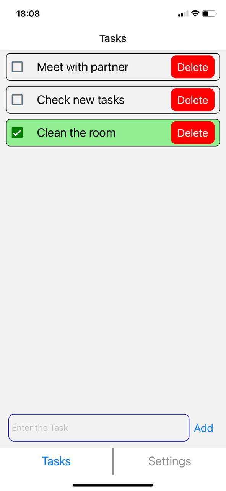
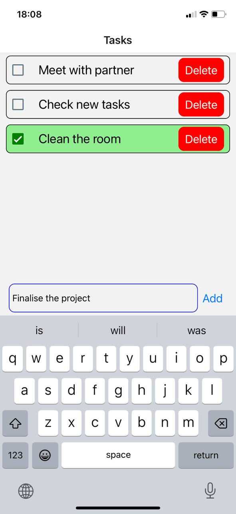
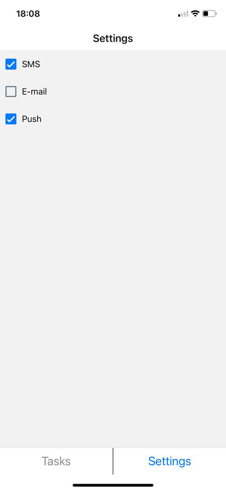

# toDoApp

ToDo List mobile app on React Native (Expo) with Redux (Toolkit)

## Visuals

 &nbsp  &nbsp  
</p>

## Description

Simple ToDo List app with below feautures: 

- Create Task, Delete Task, Mark as "Done"
- Imitation of "Settings" sreen with notification options using Redux
- Bottom-Tab navigation between screens

## Run it locally

1. Follow the [React Native Guide](https://facebook.github.io/react-native/docs/getting-started.html) for getting started building a project with native code.

2. Clone this repo

```
npm install
npm start
```

3. Install the [Expo](https://expo.io) client app on your iOS or Android phone and connect to the same wireless network as your computer. On Android, use the Expo app to scan the QR code from your terminal to open your project. On iOS, follow on-screen instructions to get a link.


## License

[MIT](https://choosealicense.com/licenses/mit/)